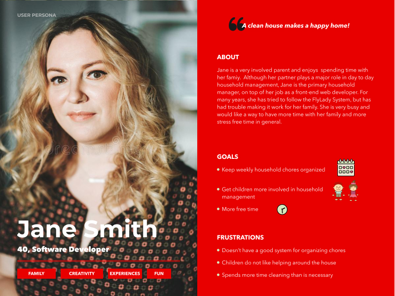
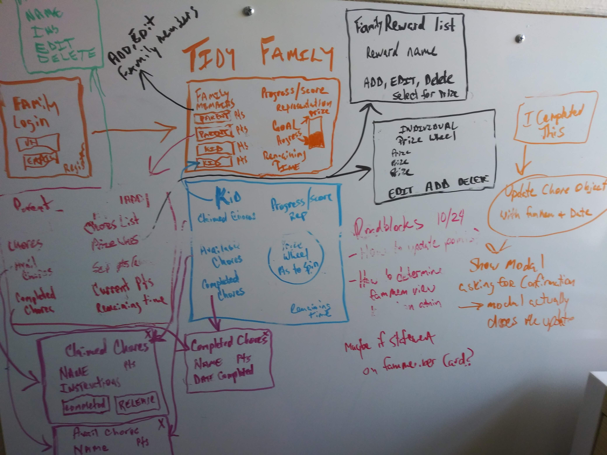
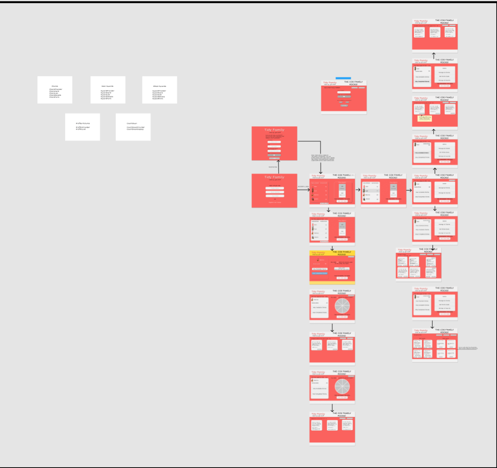
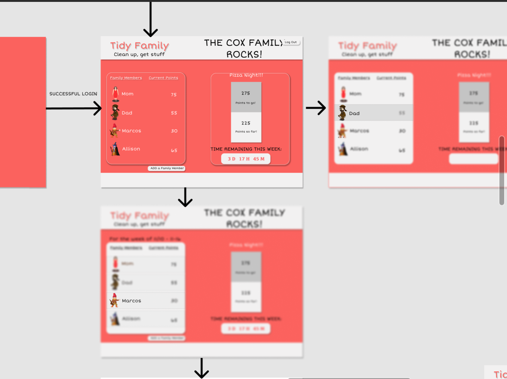

# Tidy-Family

### An App for managing weekly family chores. 

This was my front-end capstone project at Nashville Software School. This was a solo project and was completed after 3 months of front-end training.

## Challenge Statement
How might we make managing household chores easy for parents and fun for kids?

## Planning

**User Persona, Wireframes and Mockups**

            

## View Wireframe Figma
https://www.figma.com/file/yMUWi5qsjeeRdSTHcqikoT/Untitled?node-id=6%3A3398

## View ERD
https://lucid.app/invitations/accept/2aeabe95-c1d2-4869-ac0d-614abd6f5338


## JSON Database

To test this app, you will need to create a local database:
```
{
"families": [
{
"id": 1,
"famName": "Doe",
"email": "doe@gmail.com"
}
],
"familyMembers": [
{
"id": 1,
"name": "John",
"familyId": 1,
"profilePicId": 1,
"admin": true
}
],
"profilePics": [
{
"id": 1,
"name": "Bearded Man"
"src": "https://res.cloudinary.com/dwek7c0vp/image/upload/v1604679900/Tidy%20Family/man_gvldrv.svg"
    },
    {
      "id": 2,
      "name": "Girl",
      "src": "https://res.cloudinary.com/dwek7c0vp/image/upload/v1604688046/Tidy%20Family/girl_hykxzs.svg"
    },
    {
      "id": 3,
      "name": "Woman",
      "src": "https://res.cloudinary.com/dwek7c0vp/image/upload/v1604688045/Tidy%20Family/woman_vblqmn.svg"
    },
    {
      "id": 4,
      "name": "Boy",
      "src": "https://res.cloudinary.com/dwek7c0vp/image/upload/v1604688044/Tidy%20Family/boy_dhyhoy.svg"
    },
    {
      "id": 5,
      "name": "Glasses",
      "src": "https://res.cloudinary.com/dwek7c0vp/image/upload/v1604855220/Tidy%20Family/Glasses_qozq2o.svg"
    },
    {
      "id": 6,
      "name": "Pink Dress",
      "src": "https://res.cloudinary.com/dwek7c0vp/image/upload/v1604855222/Tidy%20Family/DarkGirl_tnegmf.svg"
    },
    {
      "id": 7,
      "name": "Boy in Cap",
      "src": "https://res.cloudinary.com/dwek7c0vp/image/upload/v1604855220/Tidy%20Family/HatBoy_j8kxjd.svg"
    },
    {
      "id": 8,
      "name": "Grandma",
      "src": "https://res.cloudinary.com/dwek7c0vp/image/upload/v1604855220/Tidy%20Family/Grandma_gx7kvo.svg"
    },
    {
      "id": 9,
      "name": "Blonde Girl",
      "src": "https://res.cloudinary.com/dwek7c0vp/image/upload/v1604855220/Tidy%20Family/BlondeGirl_caa3bs.svg"
    },
    {
      "id": 10,
      "name": "Blue shirt Boy",
      "src": "https://res.cloudinary.com/dwek7c0vp/image/upload/v1604855220/Tidy%20Family/DarkBoy_vgbdch.svg"
    },
    {
      "id": 11,
      "name": "Green shirt Man",
      "src": "https://res.cloudinary.com/dwek7c0vp/image/upload/v1604855194/Tidy%20Family/darkMan_llfg8u.svg"
    },
    {
      "id": 12,
      "name": "Brunette Girl",
      "src": "https://res.cloudinary.com/dwek7c0vp/image/upload/v1604855219/Tidy%20Family/brunetteGirl_ltmv8t.svg"
    },
    {
      "id": 13,
      "name": "Blonder Girl",
      "src": "https://res.cloudinary.com/dwek7c0vp/image/upload/v1604947516/Tidy%20Family/blonde_woman_si7j9m.svg"
    }
  ],
  "chores": [
  {
      "id": 1,
      "name": "Wash Dishes",
      "instructions": "Wash all dishes after supper",
      "pointsValue": 10,
      "familyId": 1,
      "familyMemberId": 1,
      "completed": true,
      "date": "11/9/2020, 8:03:26 PM"
    },
    {
      "id": 4,
      "name": "Make Bed",
      "instructions": "Pull sheets tight and tuck them in. Put pillows in the right place.",
      "pointsValue": 5,
      "familyId": 1,
      "familyMemberId": "",
      "completed": false,
      "date": ""
    }
    ],
    "mainAwards": [
    {
      "id": 1,
      "name": "Pizza Night!!",
      "description": "The whole family gets pizza from our Moe's Pizza!!",
      "pointsValue": 2000,
      "familyId": 1
    },
    {
      "id": 2,
      "name": "Movie Night",
      "description": "We will watch our favorite movie and eat popcorn",
      "pointsValue": 300,
      "familyId": 1
    }
    ],
    "wheelAwards": [
    {
      "id": 1,
      "name": "You get another new toy!",
      "description": "Get a new toy worth $5 or less",
      "familyId": 1,
      "pointsReq": 100
    },
    {
      "id": 2,
      "name": "You get ice cream!",
      "description": "Get your favorite ice cream",
      "familyId": 1,
      "pointsReq": 100
    },
    {
      "id": 3,
      "name": "A new game!",
      "description": "Get a new game or app worth $20 or less",
      "familyId": 1,
      "pointsReq": 250
    },
    {
      "id": 4,
      "name": "You get dinner date!",
      "description": "Get a dinner date with the family member of your choice",
      "familyId": 1,
      "pointsReq": 100
    },
    {
      "name": "Get a new sweater!",
      "description": "You can go sweater shopping1",
      "familyId": 1,
      "pointsReq": 200,
      "id": 5
    },
    {
      "name": "Get a new car!",
      "description": "You can go sweater shopping1",
      "familyId": 2,
      "pointsReq": 200,
      "id": 6
    },
    {
      "name": "Get a new shirt!",
      "description": "Go shopping for a new shirt",
      "familyId": 1,
      "pointsReq": 100,
      "id": 7
    },
    {
      "name": "Get a candy bar!",
      "description": "Get your favorite candy bar",
      "familyId": 1,
      "pointsReq": 50,
      "id": 8
    },
    {
      "id": 9,
      "name": "You get a new toy!",
      "description": "Get a new toy worth $5 or less",
      "familyId": 2,
      "pointsReq": 100
    },
    {
      "id": 10,
      "name": "You get ice cream!",
      "description": "Get your favorite ice cream",
      "familyId": 2,
      "pointsReq": 100
    },
    {
      "id": 11,
      "name": "A new game!",
      "description": "Get a new game or app worth $20 or less",
      "familyId": 2,
      "pointsReq": 250
    },
    {
      "id": 12,
      "name": "You get a dinner date!",
      "description": "Get a dinner date with the family member of your choice",
      "familyId": 2,
      "pointsReq": 100
    },
    {
      "name": "Get a new sweater!",
      "description": "You can go sweater shopping1",
      "familyId": 1,
      "pointsReq": 200,
      "id": 13
    },
    {
      "name": "Get a new car!",
      "description": "You can go sweater shopping1",
      "familyId": 1,
      "pointsReq": 200,
      "id": 14
    },
    {
      "name": "Get a new shirt!",
      "description": "Go shopping for a new shirt",
      "familyId": 1,
      "pointsReq": 100,
      "id": 15
    },
    {
      "name": "Get a candy bar!",
      "description": "Get your favorite candy bar",
      "familyId": 1,
      "pointsReq": 50,
      "id": 16
    }
  ]
}
```

This project was bootstrapped with [Create React App](https://github.com/facebook/create-react-app).

## Available Scripts

In the project directory, run:

### `npm start`

Runs the app in the development mode.<br />
Open [http://localhost:3000](http://localhost:3000) to view it in the browser.

The page will reload if you make edits.<br />
You will also see any lint errors in the console.

